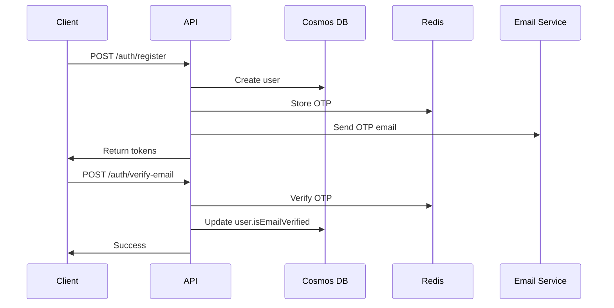
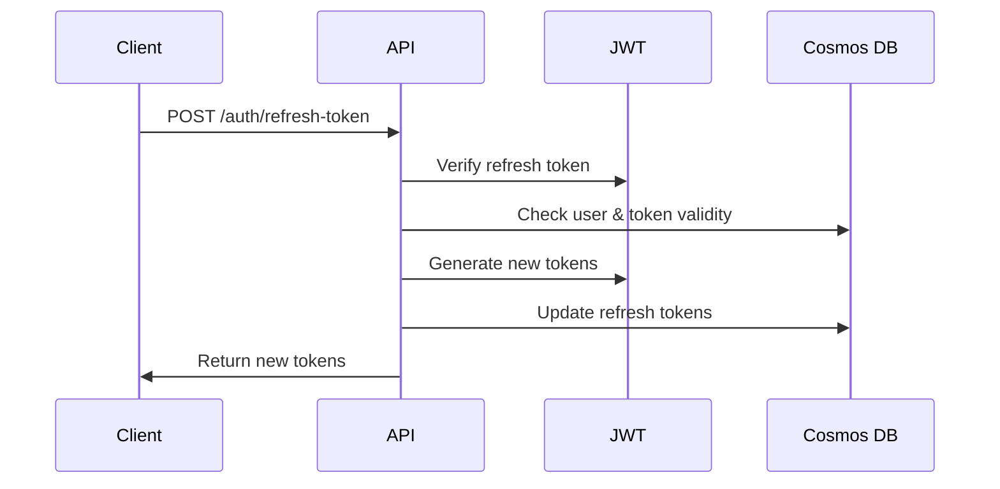

# Project Chat Backend - Production-Grade Azure Architecture


## 🎯 Overview

A **production-grade, scalable backend** for Project Chat messenger application built with **Clean Architecture** principles, powered entirely by **Microsoft Azure services**. Designed to handle millions of users with enterprise-level reliability and security.

### Key Features

- ✅ **Clean Architecture** - Separation of concerns, testable, maintainable
- ✅ **Azure-Native** - Cosmos DB, Blob Storage, Redis Cache, SignalR, App Insights
- ✅ **Real-Time Messaging** - Socket.IO + Azure SignalR integration
- ✅ **End-to-End Encryption** - Secure message encryption
- ✅ **JWT Authentication** - Access & refresh tokens
- ✅ **Email Verification** - OTP-based email verification
- ✅ **Rate Limiting** - Redis-backed rate limiting
- ✅ **Auto-Scaling** - Azure App Service with autoscaling
- ✅ **API Documentation** - Swagger/OpenAPI 3.0
- ✅ **Monitoring** - Azure Application Insights integration

---

## 🏗️ Architecture

### Clean Architecture Layers

```
backend/
├── src/
│   ├── domain/              # Business Entities & Interfaces (Core)
│   │   ├── entities/        # User, Message, Chat, Story, OTP
│   │   └── repositories/    # Repository interfaces
│   │
│   ├── application/         # Use Cases & Business Logic
│   │   ├── services/        # AuthService, ChatService, etc.
│   │   ├── controllers/     # HTTP Controllers
│   │   ├── middleware/      # Auth, validation, rate limiting
│   │   └── routes/          # Express routes
│   │
│   ├── infrastructure/      # External Adapters & Integrations
│   │   ├── database/        # Cosmos DB configuration
│   │   ├── storage/         # Azure Blob Storage
│   │   ├── cache/           # Redis Cache
│   │   └── repositories/    # Repository implementations
│   │
│   ├── utils/               # Utilities & Helpers
│   │   ├── logger.ts        # Winston logger
│   │   ├── jwt.ts           # JWT utilities
│   │   ├── encryption.ts    # Encryption helpers
│   │   └── email.ts         # Email service
│   │
│   └── server.ts            # Express app entry point
│
├── .env.example             # Environment variables template
├── package.json             # Dependencies
└── tsconfig.json            # TypeScript configuration
```

### Azure Services Used

| Service | Purpose |
|---------|---------|
| **Azure Cosmos DB** | NoSQL database for users, chats, messages |
| **Azure Blob Storage** | Media storage (images, videos, documents) |
| **Azure Redis Cache** | Session management, rate limiting, online status |
| **Azure SignalR Service** | Real-time message delivery & presence tracking |
| **Azure App Service** | Hosting & auto-scaling |
| **Azure Application Insights** | Monitoring, logging, performance tracking |
| **Azure Service Bus** | Message queuing for reliability |
| **Azure Communication Services** | Email/SMS delivery |

---

## 🚀 Quick Start

### Prerequisites

- Node.js >= 18.0.0
- Azure account with active subscription
- npm or yarn

### Installation

```bash
# Navigate to backend directory
cd backend

# Install dependencies
npm install

# Copy environment variables
cp .env.example .env

# Configure your Azure credentials in .env
```

### Environment Configuration

Edit `.env` file with your Azure credentials:

```env
# Azure Cosmos DB
COSMOS_ENDPOINT=https://your-cosmosdb.documents.azure.com:443/
COSMOS_KEY=your-cosmos-db-primary-key
COSMOS_DATABASE_NAME=ProjectChatDB

# Azure Blob Storage
AZURE_STORAGE_CONNECTION_STRING=DefaultEndpointsProtocol=https;AccountName=...

# Azure Redis Cache
REDIS_HOST=your-redis-cache.redis.cache.windows.net
REDIS_PORT=6380
REDIS_PASSWORD=your-redis-password

# JWT Secrets
JWT_SECRET=your-super-secret-jwt-key-min-32-chars
JWT_REFRESH_SECRET=your-super-secret-refresh-token-key

# Email Service
EMAIL_FROM=noreply@project-chat.com
SENDGRID_API_KEY=your-sendgrid-api-key
```

### Running the Server

```bash
# Development mode with hot reload
npm run dev

# Build for production
npm run build

# Start production server
npm start

# Run tests
npm test

# Lint code
npm run lint
```

---

## 📡 API Endpoints

### Base URL
```
Production:  https://project-chat.azurewebsites.net/api/v1
Development: http://localhost:3000/api/v1
```

### Authentication Endpoints

| Method | Endpoint | Description | Auth Required |
|--------|----------|-------------|---------------|
| POST | `/auth/register` | Register new user | ❌ |
| POST | `/auth/login` | Login user | ❌ |
| POST | `/auth/logout` | Logout user | ✅ |
| POST | `/auth/refresh-token` | Refresh access token | ❌ |
| POST | `/auth/verify-email` | Verify email with OTP | ❌ |
| POST | `/auth/resend-verification` | Resend verification email | ❌ |
| POST | `/auth/forgot-password` | Request password reset | ❌ |
| POST | `/auth/reset-password` | Reset password with OTP | ❌ |
| GET | `/auth/me` | Get current user | ✅ |

### Request/Response Examples

#### Register User

**Request:**
```bash
POST https://project-chat.azurewebsites.net/api/v1/auth/register
Content-Type: application/json

{
  "email": "user@example.com",
  "username": "johndoe",
  "password": "SecurePass123!",
  "displayName": "John Doe"
}
```

**Response (201 Created):**
```json
{
  "success": true,
  "message": "User registered successfully. Please verify your email.",
  "data": {
    "user": {
      "id": "550e8400-e29b-41d4-a716-446655440000",
      "email": "user@example.com",
      "username": "johndoe",
      "displayName": "John Doe",
      "isEmailVerified": false,
      "createdAt": "2024-01-01T00:00:00.000Z"
    },
    "tokens": {
      "accessToken": "eyJhbGciOiJIUzI1NiIsInR5cCI6IkpXVCJ9...",
      "refreshToken": "eyJhbGciOiJIUzI1NiIsInR5cCI6IkpXVCJ9...",
      "expiresIn": 900
    }
  }
}
```

#### Login

**Request:**
```bash
POST https://project-chat.azurewebsites.net/api/v1/auth/login
Content-Type: application/json

{
  "email": "user@example.com",
  "password": "SecurePass123!"
}
```

**Response (200 OK):**
```json
{
  "success": true,
  "message": "Login successful",
  "data": {
    "user": {
      "id": "550e8400-e29b-41d4-a716-446655440000",
      "email": "user@example.com",
      "username": "johndoe",
      "displayName": "John Doe",
      "avatar": "https://projectchatstorage.blob.core.windows.net/avatars/...",
      "isOnline": true
    },
    "tokens": {
      "accessToken": "eyJhbGciOiJIUzI1NiIsInR5cCI6IkpXVCJ9...",
      "refreshToken": "eyJhbGciOiJIUzI1NiIsInR5cCI6IkpXVCJ9...",
      "expiresIn": 900
    }
  }
}
```

#### Verify Email

**Request:**
```bash
POST https://project-chat.azurewebsites.net/api/v1/auth/verify-email
Content-Type: application/json

{
  "email": "user@example.com",
  "otpCode": "123456"
}
```

**Response (200 OK):**
```json
{
  "success": true,
  "message": "Email verified successfully"
}
```

---

## 🔐 Authentication Flow

### Registration & Email Verification



### Token Refresh Flow



---

## 🔒 Security Features

### 1. JWT Authentication
- Access tokens (15 minutes expiry)
- Refresh tokens (7 days expiry)
- Secure token rotation

### 2. Password Security
- Bcrypt hashing (12 rounds)
- Minimum 8 characters
- Password reset with OTP verification

### 3. Rate Limiting
- Redis-backed rate limiting
- Different limits per endpoint type
- IP-based tracking

### 4. Request Validation
- Express-validator integration
- Schema validation
- Sanitization

### 5. CORS & Helmet
- Configurable CORS origins
- Security headers via Helmet
- XSS protection

### 6. Encryption
- End-to-end message encryption
- AES-256-GCM algorithm
- Secure key management

---

## 📊 Database Schema

### Users Collection (Cosmos DB)

```typescript
{
  id: string;              // Partition key
  email: string;           // Unique
  username: string;        // Unique
  displayName: string;
  passwordHash: string;
  avatar?: string;
  isEmailVerified: boolean;
  isOnline: boolean;
  lastSeen: Date;
  privacySettings: {...};
  refreshTokens: string[];
  createdAt: Date;
  updatedAt: Date;
}
```

### Messages Collection (Cosmos DB)

```typescript
{
  id: string;
  chatId: string;          // Partition key
  senderId: string;
  text?: string;
  mediaUrl?: string;
  mediaType?: 'text' | 'image' | 'video' | 'voice' | 'file';
  status: 'sending' | 'sent' | 'delivered' | 'read';
  reactions: Reaction[];
  replyTo?: MessageReply;
  isEdited: boolean;
  isEncrypted: boolean;
  timestamp: Date;
}
```

---

## 🚀 Deployment

### Azure App Service Deployment

```bash
# Build the application
npm run build

# Deploy to Azure App Service
az webapp up --name project-chat --resource-group project-chat-rg
```

### Environment Variables in Azure

```bash
# Set environment variables in Azure App Service
az webapp config appsettings set --name project-chat \
  --resource-group project-chat-rg \
  --settings \
  NODE_ENV=production \
  COSMOS_ENDPOINT=https://... \
  JWT_SECRET=your-secret-key
```

### CI/CD with GitHub Actions

See `.github/workflows/azure-deploy.yml` for automated deployment configuration.

---

## 📈 Monitoring & Logging

### Application Insights Integration

```typescript
// Automatically tracks:
- HTTP requests & responses
- Dependencies (Cosmos DB, Redis, etc.)
- Exceptions & errors
- Custom events
- Performance metrics
```

### Winston Logger

```typescript
import { logger } from './utils/logger';

logger.info('User logged in');
logger.error('Failed to connect to database', error);
logger.warn('Rate limit exceeded');
```

---

## 🧪 Testing

```bash
# Run unit tests
npm test

# Run with coverage
npm test -- --coverage

# Run specific test file
npm test -- AuthService.test.ts
```

---

## 📚 Additional Resources

- [Azure Cosmos DB Documentation](https://docs.microsoft.com/azure/cosmos-db/)
- [Azure App Service Documentation](https://docs.microsoft.com/azure/app-service/)
- [Clean Architecture Principles](https://blog.cleancoder.com/uncle-bob/2012/08/13/the-clean-architecture.html)

---

## 🤝 Contributing

1. Fork the repository
2. Create feature branch (`git checkout -b feature/amazing-feature`)
3. Commit changes (`git commit -m 'Add amazing feature'`)
4. Push to branch (`git push origin feature/amazing-feature`)
5. Open Pull Request

---

## 📄 License

This project is licensed under the MIT License.

---

## 👥 Support

For support, email support@project-chat.com or open an issue in the repository.

---

## 🎉 Acknowledgments

Built with ❤️ using:
- Node.js & TypeScript
- Express.js
- Microsoft Azure
- Clean Architecture principles
